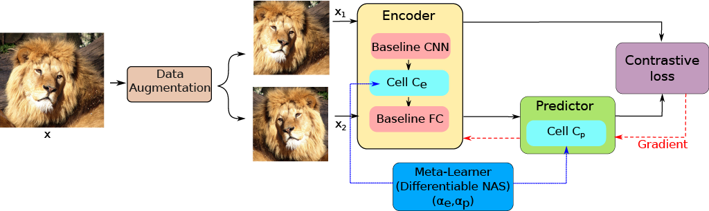

# NASiam: Efficient Representation Learning using Neural Architecture Search for Siamese Networks

<p align="center">
    
</p>

This is the official PyTorch implementation of the [NASiam paper](http://arxiv.org/abs/2302.00059).
## Preparation

- Install the most recent version of [PyTorch](https://pytorch.org/get-started/locally/) (the code was tested on version 1.12.1).

## Searching

### SimSiam

To search for a SimSiam arch for 100 epochs on CIFAR-10 on a single GPU, run:

```bash
  cd SimSiam && python main_search.py -a resnet18 --gpu 0 --lr 0.06 --wd 5e-4 --dataset cifar10 --fix-pred-lr [your CIFAR folder]
```

### MoCo

To search for a MoCo arch for 100 epochs on CIFAR-10 on a single GPU, run:

```bash
  cd MoCo && python main_search.py -a resnet18 --gpu 0 --dataset cifar10 [your CIFAR folder]
```

### SimCLR

To search for a SimCLR arch for 100 epochs on CIFAR-10 on a single GPU, run:

```bash
  cd SimCLR && python main_search.py --gpu 0 --dataset cifar10 [your CIFAR folder]
```

## Unsupervised Pre-Training

All scripts use the default hyper-parameters as described in their respective original papers, and use the default augmentation recipe from [MoCo v2](https://arxiv.org/abs/2003.04297). 

### SimSiam

To do unsupervised pre-training of a ResNet-18 model on CIFAR on a single GPU for 800 epochs, run:
```bash

cd SimSiam && python main_simsiam.py -a resnet18 --epochs 800 --lr 0.06 --wd 5e-4 -g cifar10_resnet18 --fix-pred-lr [your CIFAR folder]
```

To pre-train a ResNet-50 model on ImageNet on an 8-GPU machine for 100 epochs, run:
```bash

cd SimSiam && python main_simsiam.py \
  -a resnet50 \
  -g cifar100_resnet50
  --dist-url 'tcp://localhost:10001' --multiprocessing-distributed --world-size 1 --rank 0 \
  --fix-pred-lr \
  [your imagenet-folder with train and val folders]
```

### MoCo

To do unsupervised pre-training of a ResNet-18 model on CIFAR on a single GPU for 800 epochs, run:
```bash

cd MoCo && python main_moco.py -a resnet18 --epochs 800 --lr 0.06 --wd 5e-4 -g cifar10_resnet18 [your CIFAR folder]
```

To pre-train a ResNet-50 model on ImageNet on an 8-GPU machine for 100 epochs, run:
```bash

cd MoCo && python main_moco.py \
  -a resnet50 \
  -g cifar100_resnet50
  --dist-url 'tcp://localhost:10001' --multiprocessing-distributed --world-size 1 --rank 0 \
  --moco-t 0.07 --moco-k 65536 --moco-m 0.999 \
  [your imagenet-folder with train and val folders]
```

### SimCLR

**Only ResNet-50 is supported for now.**

To do unsupervised pre-training of a ResNet-50 model on CIFAR on a single GPU for 800 epochs, run:
```bash

cd SimCLR && python main.py --epochs 800 -g cifar10_resnet50 --fix-pred-lr [your CIFAR folder]
```

To pre-train a ResNet-50 model on ImageNet on an 8-GPU machine for 100 epochs, run:
```bash

cd SimCLR && python main_moco.py \
  -a resnet50 \
  -g cifar100_resnet50
  --dist-url 'tcp://localhost:10001' --multiprocessing-distributed --world-size 1 --rank 0 \
  --moco-t 0.07 --moco-k 65536 --moco-m 0.999 \
  [your imagenet-folder with train and val folders]
```

## Linear Classification

For linear classification we recommend to use the `pretrained_model_best.pth.tar` file produced using the KNN monitor for best results (rather than the last training checkpoint).

### SimSiam

To train a supervised linear classifier on frozen features/weights on CIFAR on a single GPU, run:
```bash
cd SimSiam && python main_lincls.py -a resnet18 --pretrained [your checkpoint path] --lr 30.0 --dataset cifar10 [your CIFAR folder]
```

To train a supervised linear classifier on frozen features/weights on an 8-GPU machine, run:
```bash
cd SimSiam && python main_lincls.py \
  -a resnet50 \
  --dist-url 'tcp://localhost:10001' --multiprocessing-distributed --world-size 1 --rank 0 \
  --lr 30.0 -b 256
  --pretrained [your checkpoint path] \
  [your imagenet-folder with train and val folders]
```

### MoCo

To train a supervised linear classifier on frozen features/weights on CIFAR on a single GPU, run:
```bash
cd MoCo && python main_lincls.py -a resnet18 --pretrained [your checkpoint path] --lr 30.0 --dataset cifar10 [your CIFAR folder]
```

To train a supervised linear classifier on frozen features/weights on an 8-GPU machine, run:
```bash
cd MoCo && python main_lincls.py \
  -a resnet50 \
  --dist-url 'tcp://localhost:10001' --multiprocessing-distributed --world-size 1 --rank 0 \
  --lr 30.0 -b 256
  --pretrained [your checkpoint path] \
  [your imagenet-folder with train and val folders]
```


### SimCLR

To train a supervised linear classifier on frozen features/weights on CIFAR on a single GPU, run:
```bash
cd SimCLR && python linear.py --pretrained [your checkpoint path] --dataset cifar10 [your CIFAR folder]
```

To train a supervised linear classifier on frozen features/weights on an 8-GPU machine, run:
```bash
cd SimCLR && python linear.py \
  --dist-url 'tcp://localhost:10001' --multiprocessing-distributed --world-size 1 --rank 0 \
  --batch_size 256
  --pretrained [your checkpoint path] \
  [your imagenet-folder with train and val folders]
```

### Model zoo

NASiam pre-trained models can be found inside the `models` folder.

### License

This project is under the CC-BY-NC 4.0 license. See [LICENSE](LICENSE) for details.

### Citation

If you found this code useful for your research, please consider citing the NASiam paper:
```
@Article{heuillet2023NASiam,
  author  = {Alexandre Heuillet and Hedi Tabia and Hichem Arioui},
  title   = {NASiam: Efficient Representation Learning using Neural Architecture Search for Siamese Networks},
  url = {https://arxiv.org/abs/2302.00059},
  publisher={arXiv}
  }
```

### Aknowledgements

This code is based upon [SimSiam](https://github.com/facebookresearch/simsiam), [MoCo](https://github.com/facebookresearch/moco) and [SimCLR](https://github.com/leftthomas/SimCLR).
